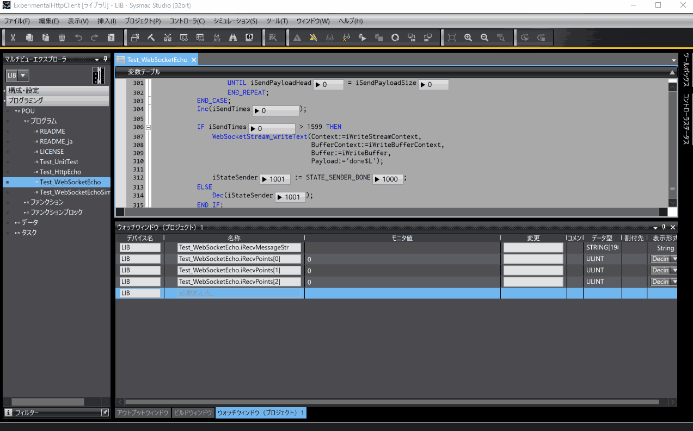

<!--
# Experimental HTTP/1.1 And WebSocket Client for NX
これは、OMRON社のNXコントローラ向けのHTTP/1.1及びWebSocketクライアントの試験実装です。
このHTTPクライアントは機能に不足があり、品質も十分ではありません。
しかし、Sysmac StudioとNXコントローラにおいて、実用的なHTTPクライアントをユーザープログラムで実装可能であることを示すものです。
Sysmacプロジェクトはいくつかのテストプログラムを含みます。
HTTPクライアントのテストプログラムは、BeeceptorのHTTPエコーサーバへ問い合わせを行い、
WebSocketクライアントのテストプログラムは、WebSocket.orgのWebSocketエコーサーバを介したデータ授受を行います。
詳細は、[この記事](https://zenn.dev/kitam/articles/125abd8e5a1e9f)を確認してください。

HTTPクライアントには以下の制約があります。

* プロキシを使用できない
* 不正なレスポンスによってタスクがタイムオーバーする可能性がある

HTTP(S)による問い合わせは以下のように記述できます。

```iecsst
    // POST /chat/api/v1 ContentType: application/json
    20:
        IF NewHttpClientTask(
               Context:=iHttpContext,
               ClientTask:=iHttpClientTask)
        THEN
            HttpPost(Context:=iHttpContext,
                     Url:='https://echo.free.beeceptor.com/chat/api/v1',
                     KeepAlive:=FALSE,
                     ClientTask:=iHttpClientTask);
            SetHttpHeader(Context:=iHttpContext,
                          Key:='X-Api-Key',
                          Value:='xxxxxx');
            SetContentStr(Context:=iHttpContext,
                          ContentType:='application/json',
                          Content:='{"channel":"hell","name":"taker","msg":"Have you played Awaria?"}');
            iPostTick := 0;
            InvokeHttpClientTask(Context:=iHttpContext,
                                 ClientTask:=iHttpClientTask);
            
            Inc(iState);
        END_IF;
    21:
        CASE HttpClientTaskState(Context:=iHttpContext,
                                 ClientTask:=iHttpClientTask) OF
            HTTP_CLIENT_TASK_STATE_CLOSED:
                iState := iTransState;
            HTTP_CLIENT_TASK_STATE_RESPOND:
                CASE GetStatusCode(Context:=iHttpContext) OF
                    200: // OK
                        iPostRspContentType
                            := GetContentType(Context:=iHttpContext); 
                        GetContent(Context:=iHttpContext,
                                   Out:=iRspBinBody,
                                   Head:=0,
                                   Size=>iRspBinBodySize);
                        iPostRspContent
                            := AryToString(In:=iRspBinBody[0],
                                           Size:=iRspBinBodySize);
                        
                        iState := iTransState;
                    204: // No Content
                        iState := iTransState;
                ELSE
                    Inc(iState);
                END_CASE;
            HTTP_CLIENT_TASK_STATE_REQUESTING:
                Inc(iPostTick);
            HTTP_CLIENT_TASK_STATE_ERROR:
                GetHttpClientError(Context:=iHttpContext,
                                   Error=>iError,
                                   ErrorID=>iErrorID,
                                   ErrorIDEx=>iErrorIDEx);
                iState := iState + 7;
        END_CASE;
```

WebSocketクライアントは以下のように記述できます。

```iecsst
CASE iState OF
    0:
        RingBuffer_init(Context:=iWriteBufferContext,
                        Buffer:=iWriteBuffer);
        RingBuffer_init(Context:=iReadBufferContext,
                        Buffer:=iReadBuffer);
        WebSocketClientService_init(
            Context:=iServiceContext,
            Url:='wss://echo.websocket.org/.ws',
            TLSSessionName:='TLSSession1',
            OptionNoDelay:=TRUE,
            SendThreshold:=0);
        iService.Enable := TRUE;

        Inc(iState);
    1:
        IF WebSocketClientService_isActive(Context:=iServiceContext) THEN
            WebSocketClientService_getStreamContext(
                Context:=iServiceContext,
                WriteStreamContext=>iWriteStreamContext,
                ReadStreamContext=>iReadStreamContext);
            
            Inc(iState);
        END_IF;
    2:
        CASE WebSocketClientService_getState(Context:=iServiceContext) OF
            WEBSOCKET_CLIENT_STATE#WCS_ACTIVE:
                // Receive messages.
                CASE WebSocketStream_on(
                         Context:=iReadStreamContext,
                         BufferContext:=iReadBufferContext,
                         Buffer:=iReadBuffer,
                         Data:=iRecvPayload,
                         Head:=iRecvPayloadHead,
                         Size=>iRecvPayloadSize,
                         PayloadLength=>iPayloadLength,
                         Done=>iDoneFrame)
                OF
                    WEBSOCKET_FRAME_TYPE#WFT_TEXT:
                        iRecvPayloadHead
                            := iRecvPayloadHead + iRecvPayloadSize;
                        IF iDoneFrame THEN
                            iRecvMessageStr
                                := AryToString(In:=iRecvPayload[0],
                                               Size:=iRecvPayloadHead);
                            iRecvPayloadHead := 0;
                        END_IF;
                END_CASE;
                
                // Send messages.
                IF iSend THEN
                    WebSocketStream_writeText(
                        Context:=iWriteStreamContext,
                        BufferContext:=iWriteBufferContext,
                        Buffer:=iWriteBuffer,
                        Payload:=CONCAT(DtToString(GetTime()), '$L'));
                    iSend := FALSE;
                END_IF;
                
                // Close the connection.
                IF iClose THEN
                    WebSocketClientService_deactivate(
                        Context:=iServiceContext,
                        CloseCode:=1001);
                    iClose := FALSE;
                    
                    Inc(iState);
                END_IF;
                
            WEBSOCKET_CLIENT_STATE#WCS_DEACTIVATING:
                Inc(iState);
        END_CASE;
    3:
        iService.Enable := FALSE;
        
        Inc(iState);                        
END_CASE;

iService(Context:=iServiceContext,
         WriteBufferContext:=iWriteBufferContext,
         WriteBuffer:=iWriteBuffer,
         ReadBufferContext:=iReadBufferContext,
         ReadBuffer:=iReadBuffer);
```
-->
# Experimental HTTP/1.1 And WebSocket Client for NX
This is an experimental implementation of HTTP/1.1 and WebSocket client for OMRON's NX controllers.
This HTTP client lacks functionality and is not of sufficient quality.
However, it shows that it is possible to implement a practical HTTP client with a user program using Sysmac Studio and the NX controller.
The Sysmac project contains several test programs.
The HTTP client test program queries Beeceptor's HTTP echo server,
and the WebSocket client test program exchanges data via WebSocket.org's WebSocket echo server.
For details, please check [this article (Japanese)](https://zenn.dev/kitam/articles/125abd8e5a1e9f). 

The HTTP client has the following restrictions.

* **Can't use proxy**
* **Invalid responses can cause tasks to time out**

Inquiries using HTTP(S) can be written as follows.

```iecst
// POST /chat/api/v1 ContentType: application/json
20:
    IF NewHttpClientTask(
            Context:=iHttpContext,
            ClientTask:=iHttpClientTask)
    THEN
        HttpPost(Context:=iHttpContext,
                 Url:='https://echo.free.beeceptor.com/chat/api/v1',
                 KeepAlive:=FALSE,
                 ClientTask:=iHttpClientTask);
        SetHttpHeader(Context:=iHttpContext,
                      Key:='X-Api-Key',
                      Value:='xxxxxx');
        SetContentStr(
            Context:=iHttpContext,
            ContentType:='application/json',
            Content:='{"channel":"hell","name":"taker","msg":"Have you played Awaria?"}');
        iPostTick := 0;
        InvokeHttpClientTask(Context:=iHttpContext,
                             ClientTask:=iHttpClientTask);
            
        Inc(iState);
    END_IF;
21:
    CASE HttpClientTaskState(Context:=iHttpContext,
                            ClientTask:=iHttpClientTask) OF
        HTTP_CLIENT_TASK_STATE_CLOSED:
            iState := iTransState;
        HTTP_CLIENT_TASK_STATE_RESPOND:
            CASE GetStatusCode(Context:=iHttpContext) OF
                200: // OK
                    iPostRspContentType
                        := GetContentType(Context:=iHttpContext); 
                    GetContent(Context:=iHttpContext,
                               Out:=iRspBinBody,
                               Head:=0,
                               Size=>iRspBinBodySize);
                    iPostRspContent
                        := AryToString(In:=iRspBinBody[0],
                                       Size:=iRspBinBodySize);
                        
                    iState := iTransState;
                204: // No Content
                    iState := iTransState;
            ELSE
                Inc(iState);
            END_CASE;
        HTTP_CLIENT_TASK_STATE_REQUESTING:
            Inc(iPostTick);
        HTTP_CLIENT_TASK_STATE_ERROR:
            GetHttpClientError(Context:=iHttpContext,
                               Error=>iError,
                               ErrorID=>iErrorID,
                               ErrorIDEx=>iErrorIDEx);
            iState := iState + 7;
    END_CASE;
```

The WebSocket client can be written as follows.

```iecsst
CASE iState OF
    0:
        RingBuffer_init(Context:=iWriteBufferContext,
                        Buffer:=iWriteBuffer);
        RingBuffer_init(Context:=iReadBufferContext,
                        Buffer:=iReadBuffer);
        WebSocketClientService_init(
            Context:=iServiceContext,
            Url:='wss://echo.websocket.org/.ws',
            TLSSessionName:='TLSSession1',
            OptionNoDelay:=TRUE,
            SendThreshold:=0);
        iService.Enable := TRUE;

        Inc(iState);
    1:
        IF WebSocketClientService_isActive(Context:=iServiceContext) THEN
            WebSocketClientService_getStreamContext(
                Context:=iServiceContext,
                WriteStreamContext=>iWriteStreamContext,
                ReadStreamContext=>iReadStreamContext);
            
            Inc(iState);
        END_IF;
    2:
        CASE WebSocketClientService_getState(Context:=iServiceContext) OF
            WEBSOCKET_CLIENT_STATE#WCS_ACTIVE:
                // Receive messages.
                CASE WebSocketStream_on(
                         Context:=iReadStreamContext,
                         BufferContext:=iReadBufferContext,
                         Buffer:=iReadBuffer,
                         Data:=iRecvPayload,
                         Head:=iRecvPayloadHead,
                         Size=>iRecvPayloadSize,
                         PayloadLength=>iPayloadLength,
                         Done=>iDoneFrame)
                OF
                    WEBSOCKET_FRAME_TYPE#WFT_TEXT:
                        iRecvPayloadHead
                            := iRecvPayloadHead + iRecvPayloadSize;
                        IF iDoneFrame THEN
                            iRecvMessageStr
                                := AryToString(In:=iRecvPayload[0],
                                               Size:=iRecvPayloadHead);
                            iRecvPayloadHead := 0;
                        END_IF;
                END_CASE;
                
                // Send messages.
                IF iSend THEN
                    WebSocketStream_writeText(
                        Context:=iWriteStreamContext,
                        BufferContext:=iWriteBufferContext,
                        Buffer:=iWriteBuffer,
                        Payload:=CONCAT(DtToString(GetTime()), '$L'));
                    iSend := FALSE;
                END_IF;
                
                // Close the connection.
                IF iClose THEN
                    WebSocketClientService_deactivate(
                        Context:=iServiceContext,
                        CloseCode:=1001);
                    iClose := FALSE;
                    
                    Inc(iState);
                END_IF;
                
            WEBSOCKET_CLIENT_STATE#WCS_DEACTIVATING:
                Inc(iState);
        END_CASE;
    3:
        iService.Enable := FALSE;
        
        Inc(iState);                        
END_CASE;

iService(Context:=iServiceContext,
         WriteBufferContext:=iWriteBufferContext,
         WriteBuffer:=iWriteBuffer,
         ReadBufferContext:=iReadBufferContext,
         ReadBuffer:=iReadBuffer);
```
<!--
# 使用環境
このプロジェクトの使用には、次の環境が必要です。

|Item|Requirement|
|-|-|
|コントローラ|NX1またはNX5|
|Sysmac Studio|最新版を推奨|
|ネットワーク|インターネット接続可能|
-->
## Operating environment
To use this project, the following environment is required.

|Item|Requirement|
|-|-|
|Controller|NX1 or NX5|
|Sysmac Studio|Latest version recommended|
|Network|Internet connection must be possible|
<!--
# 構築した環境
このプロジェクトは、次の環境で構築しました。

|Item|Version|
|-|-|
|コントローラ|NX102-9000 Ver 1.64|
|Sysmac Studio|Ver.1.62|
-->
## Development environment
This project was developed using the following environment.

|Item|Version|
|-|-|
|Controller|NX102-9000 Ver 1.64|
|Sysmac Studio|Ver.1.62|
<!--
## HTTPクライアントテストプログラムの使用手順
HTTPクライアントのテストプログラム(Test_HttpEcho)は、BeeceptorのHTTPエコーサーバへの問い合わせを行います。
自身の管理下にないネットワークからアクセスする場合、何らかの制約がある可能性があります。
可能であれば、制約がないことを確認できるテスト用のネットワークを使用します。

### 1. コントローラ設定を変更
このプロジェクトのコントローラ型式を使用するコントローラの型式に合わせ、インターネット接続と名前解決ができるように設定します。
少なくともゲートウェイとDNSサーバの設定が必要です。

### 2. コントローラをプログラムモードに変更
コントローラの意図しない動作の防止、セキュアソケット設定のためにプログラムモードにします。

### 3. Sysmacプロジェクトをコントローラに転送
プログラムが動作しないよう、コントローラはプログラムモードを維持してください。

### 4. セキュアソケット設定にTLSセッションを登録
IDが`0`でクライアント証明書の無いTLSセッションを登録します。
コントローラにオンラインした状態で以下のように行います。


### 5. ウォッチウィンドウに変数を登録
以下をウォッチウィンドウに貼り付けます。

```
LIB	Test_HttpEcho.iGetRspContent
LIB	Test_HttpEcho.iPostRspContent
LIB	Test_HttpEcho.iPostFormRspContent
LIB	Test_HttpEcho.iPutRspContent
LIB	Test_HttpEcho.iPatchRspContent
LIB	Test_HttpEcho.iDeleteRspContent
```

### 6. コントローラを運転モードに変更
運転モードに切り替えた瞬間から、サーバへのリクエストを開始します。

### 7. ウォッチウィンドウを確認
サーバからの応答があれば、以下のようにHTTPレスポンスが表示されます。


-->
## HTTP client test program usage steps
The HTTP client test program (Test_HttpEcho) queries [Beeceptor's HTTP echo server](https://beeceptor.com/resources/http-echo/).
There may be some restrictions when accessing from a network that is not under your control.
If possible, use a test network to ensure there are no constraints.

### 1. Change controller settings
Set the controller model of this project to match the controller model to be used,
and to enable Internet connection and name resolution.
At least the gateway and DNS server settings are required.

### 2. Change controller to program mode
Set the controller to program mode to prevent unintended operation and to configure secure sockets.

### 3. Transfer Sysmac project to controller
Keep the controller in program mode to prevent the program from running.

### 4. Register TLS session in secure socket settings
Register a TLS session with `ID 0` and no client certificate. Do the following while online to the controller.


### 5. Register variables in Watch window
Paste the following into Watch window.

```
LIB	Test_HttpEcho.iGetRspContent
LIB	Test_HttpEcho.iPostRspContent
LIB	Test_HttpEcho.iPostFormRspContent
LIB	Test_HttpEcho.iPutRspContent
LIB	Test_HttpEcho.iPatchRspContent
LIB	Test_HttpEcho.iDeleteRspContent
```

### 6. Change controller to operation mode
The moment you switch to driving mode, it starts making requests to the server.

### 7. Check Watch window
If there is a response from the server, the HTTP response will be displayed as shown below.


If an error occurs, there are the following possibilities: 

* Incorrect secure socket settings   
  Check if the ID is `0`.
* HTTP echo server is down   
  Ping the HTTP echo server from your device and check the response.
* Not connected to the Internet or unable to resolve name   
  Check the route to the HTTP echo server with tracert.

<!--
## WebSocketクライアントテストプログラムの使用手順
WebSocketクライアントのテストプログラム(Test_WebSocketEcho)は、WebSocket.orgのWebSocketエコーサーバを介したデータ授受を行います。
自身の管理下にないネットワークからアクセスする場合、何らかの制約がある可能性があります。
可能であれば、制約がないことを確認できるテスト用のネットワークを使用します。

### 1. コントローラ設定を変更
このプロジェクトのコントローラ型式を使用するコントローラの型式に合わせ、インターネット接続と名前解決ができるように設定します。
少なくともゲートウェイとDNSサーバの設定が必要です。

### 2. コントローラをプログラムモードに変更
コントローラの意図しない動作の防止、セキュアソケット設定のためにプログラムモードにします。

### 3. Sysmacプロジェクトをコントローラに転送
プログラムが動作しないよう、コントローラはプログラムモードを維持してください。

### 4. セキュアソケット設定にTLSセッションを登録
IDが`1`でクライアント証明書の無いTLSセッションを登録します。

### 5. コントローラを運転モードに変更
運転モードに切り替えた瞬間から、サーバへのリクエストを開始します。

### 6. 処理結果を確認
プログラムが正常に動作すると、最後に"done\n"という文字列を受信して処理を終了します。
-->
## WebSocket client test program usage steps
The WebSocket client test program (Test_WebSocketEcho) sends and receives data via the [WebSocket echo server](https://websocket.org/tools/websocket-echo-server) at [WebSocket.org](https://websocket.org/).
There may be some restrictions when accessing from a network that is not under your control.
If possible, use a test network to ensure there are no constraints.

### 1. Change controller settings
Set the controller model of this project to match the controller model to be used,
and to enable Internet connection and name resolution.
At least the gateway and DNS server settings are required.

### 2. Change controller to program mode
Set the controller to program mode to prevent unintended operation and to configure secure sockets.

### 3. Transfer Sysmac project to controller
Keep the controller in program mode to prevent the program from running.

### 4. Register TLS session in secure socket settings
Register a TLS session with `ID 1` and no client certificate.

### 5. Change controller to operation mode
The moment you switch to driving mode, it starts making requests to the server.

### 6. Check the processing results
If the program runs correctly, it will eventually receive the string "done\n" and exit.



If an error occurs, there are the following possibilities: 

* Incorrect secure socket settings   
  Check if the ID is `1`.
* WebSocket echo server is down   
  Ping the WebSocket echo server from your device and check the response.
* Not connected to the Internet or unable to resolve name   
  Check the route to the WebSocket echo server with tracert.
