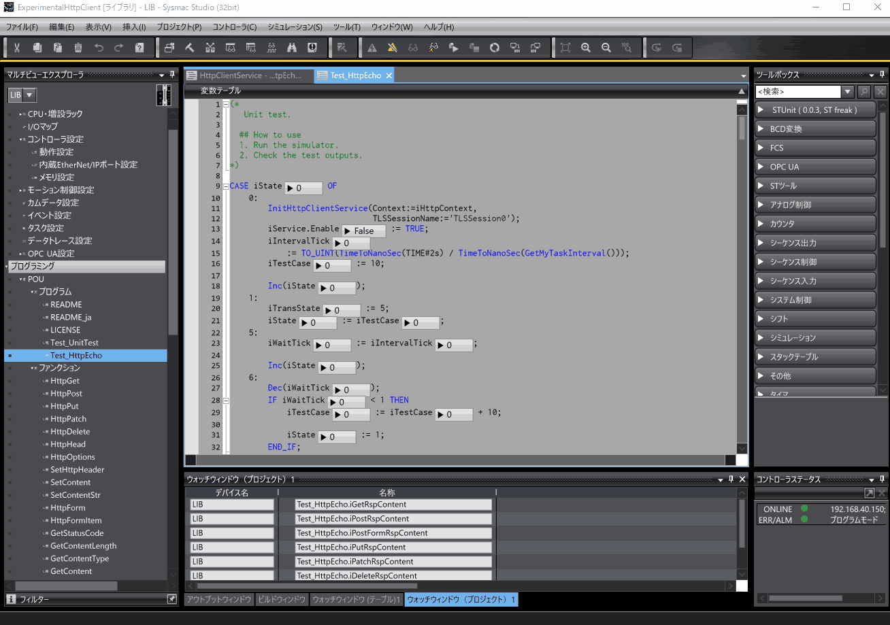
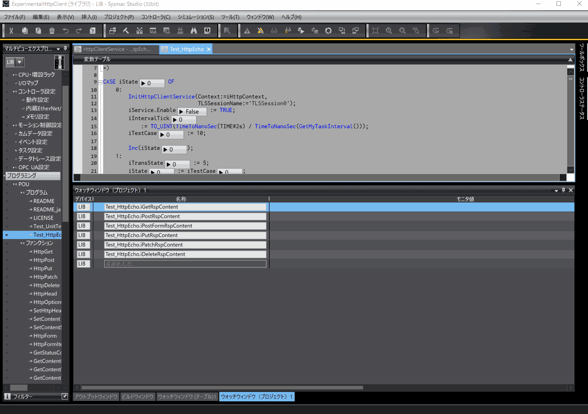

<!--
# Experimental HttpClient for NX/NJ
これは、OMRON社のNX/NJコントローラ向けのHTTP/1.1クライアントの試験実装です。このHTTPクライアントは機能に不足があり、品質も十分ではありません。しかし、Sysmac StudioとNX/NJコントローラにおいて、実用的なHTTPクライアントをユーザープログラムで実装可能であることを示すものです。Sysmacプロジェクトはいくつかのテストプログラムを含み、実際にBeeceptorのHTTPエコーサーバへ問い合わせを行います。詳細は、[この記事](https://zenn.dev/kitam/articles/125abd8e5a1e9f)を確認してください。

HTTPクライアントには以下の制約があります。

* プロキシを使用できない
* 不正なレスポンスによってタスクがタイムオーバーする可能性がある

HTTP(S)による問い合わせは以下のように記述できます。

```iecsst
    // POST /chat/api/v1 ContentType: application/json
    20:
        IF NewHttpClientTask(
               Context:=iHttpContext,
               ClientTask:=iHttpClientTask)
        THEN
            HttpPost(Context:=iHttpContext,
                     Url:='https://echo.free.beeceptor.com/chat/api/v1',
                     KeepAlive:=FALSE,
                     ClientTask:=iHttpClientTask);
            SetHttpHeader(Context:=iHttpContext,
                          Key:='X-Api-Key',
                          Value:='xxxxxx');
            SetContentStr(Context:=iHttpContext,
                          ContentType:='application/json',
                          Content:='{"channel":"hell","name":"taker","msg":"Have you played Awaria?"}');
            iPostTick := 0;
            InvokeHttpClientTask(Context:=iHttpContext,
                                 ClientTask:=iHttpClientTask);
            
            Inc(iState);
        END_IF;
    21:
        CASE HttpClientTaskState(Context:=iHttpContext,
                                 ClientTask:=iHttpClientTask) OF
            HTTP_CLIENT_TASK_STATE_CLOSED:
                iState := iTransState;
            HTTP_CLIENT_TASK_STATE_RESPOND:
                CASE GetStatusCode(Context:=iHttpContext) OF
                    200: // OK
                        iPostRspContentType
                            := GetContentType(Context:=iHttpContext); 
                        GetContent(Context:=iHttpContext,
                                   Out:=iRspBinBody,
                                   Head:=0,
                                   Size=>iRspBinBodySize);
                        iPostRspContent
                            := AryToString(In:=iRspBinBody[0],
                                           Size:=iRspBinBodySize);
                        
                        iState := iTransState;
                    204: // No Content
                        iState := iTransState;
                ELSE
                    Inc(iState);
                END_CASE;
            HTTP_CLIENT_TASK_STATE_REQUESTING:
                Inc(iPostTick);
            HTTP_CLIENT_TASK_STATE_ERROR:
                GetHttpClientError(Context:=iHttpContext,
                                   Error=>iError,
                                   ErrorID=>iErrorID,
                                   ErrorIDEx=>iErrorIDEx);
                iState := iState + 7;
        END_CASE;
```
-->
# Experimental HTTP Client for NX/NJ
This is an experimental implementation of HTTP/1.1 client for OMRON's NX/NJ controllers. This HTTP client lacks functionality and is not of sufficient quality. However, it shows that it is possible to implement a practical HTTP client with a user program using Sysmac Studio and the NX/NJ controller. The Sysmac project contains several test programs that actually query Beeceptor's HTTP echo server. For details, please check [this article (Japanese)](https://zenn.dev/kitam/articles/125abd8e5a1e9f). 

The HTTP client has the following restrictions.

* **Can't use proxy**
* **Invalid responses can cause tasks to time out**

Inquiries using HTTP(S) can be written as follows.

```iecst
    // POST /chat/api/v1 ContentType: application/json
    20:
        IF NewHttpClientTask(
               Context:=iHttpContext,
               ClientTask:=iHttpClientTask)
        THEN
            HttpPost(Context:=iHttpContext,
                     Url:='https://echo.free.beeceptor.com/chat/api/v1',
                     KeepAlive:=FALSE,
                     ClientTask:=iHttpClientTask);
            SetHttpHeader(Context:=iHttpContext,
                          Key:='X-Api-Key',
                          Value:='xxxxxx');
            SetContentStr(
                Context:=iHttpContext,
                ContentType:='application/json',
                Content:='{"channel":"hell","name":"taker","msg":"Have you played Awaria?"}');
            iPostTick := 0;
            InvokeHttpClientTask(Context:=iHttpContext,
                                 ClientTask:=iHttpClientTask);
            
            Inc(iState);
        END_IF;
    21:
        CASE HttpClientTaskState(Context:=iHttpContext,
                                 ClientTask:=iHttpClientTask) OF
            HTTP_CLIENT_TASK_STATE_CLOSED:
                iState := iTransState;
            HTTP_CLIENT_TASK_STATE_RESPOND:
                CASE GetStatusCode(Context:=iHttpContext) OF
                    200: // OK
                        iPostRspContentType
                            := GetContentType(Context:=iHttpContext); 
                        GetContent(Context:=iHttpContext,
                                   Out:=iRspBinBody,
                                   Head:=0,
                                   Size=>iRspBinBodySize);
                        iPostRspContent
                            := AryToString(In:=iRspBinBody[0],
                                           Size:=iRspBinBodySize);
                        
                        iState := iTransState;
                    204: // No Content
                        iState := iTransState;
                ELSE
                    Inc(iState);
                END_CASE;
            HTTP_CLIENT_TASK_STATE_REQUESTING:
                Inc(iPostTick);
            HTTP_CLIENT_TASK_STATE_ERROR:
                GetHttpClientError(Context:=iHttpContext,
                                   Error=>iError,
                                   ErrorID=>iErrorID,
                                   ErrorIDEx=>iErrorIDEx);
                iState := iState + 7;
        END_CASE;
```
<!--
# 使用環境
このプロジェクトの使用には、次の環境が必要です。

|||
|-|-|
|コントローラ|NX1またはNX5|
|Sysmac Studio|最新版を推奨します。|
|ネットワーク|インターネット接続が可能であること。|
-->
## Usage environment
The following environment is required to use this project

|||
|-|-|
|Controller|NX1 or NX5|
|Sysmac Studio|I always recommend the latest version.|
|Network|Must be able to connect to the Internet.|
<!--
# 構築した環境
このプロジェクトは、次の環境で構築しました。

|||
|-|-|
|コントローラ|NX102-9000 Ver 1.64|
|Sysmac Studio|Ver.1.61|
-->
## Built environment
This project was built in the following environment.

|||
|-|-|
|Controller|NX102-9000 Ver 1.64|
|Sysmac Studio|Ver.1.61|
<!--
# テストプログラムの使用手順
Sysmacプロジェクトは、BeeceptorのHTTPエコーサーバへの問い合わせを行うテストプログラム(Test_HttpEcho)を含んでいます。自身の管理下にないネットワークからアクセスする場合、何らかの制約がある可能性があります。可能であれば、制約がないことを確認できるテスト用のネットワークを使用します。

### 1. コントローラ設定を変更
このプロジェクトのコントローラ型式を使用するコントローラの型式に合わせ、インターネット接続と名前解決ができるように設定します。少なくともゲートウェイとDNSサーバの設定が必要です。

### 2. コントローラをプログラムモードに変更
コントローラの意図しない動作の防止、セキュアソケット設定のためにプログラムモードにします。

### 3. Sysmacプロジェクトをコントローラに転送
プログラムが動作しないよう、コントローラはプログラムモードを維持してください。

### 4. セキュアソケット設定にTLSセッションを登録
IDがゼロでクライアント証明書の無いTLSセッションを登録します。コントローラにオンラインした状態で以下のように行います。



### 5. ウォッチウィンドウに変数を登録
以下をウォッチウィンドウに貼り付けます。

```
LIB	Test_HttpEcho.iGetRspContent
LIB	Test_HttpEcho.iPostRspContent
LIB	Test_HttpEcho.iPostFormRspContent
LIB	Test_HttpEcho.iPutRspContent
LIB	Test_HttpEcho.iPatchRspContent
LIB	Test_HttpEcho.iDeleteRspContent
```

### 6. コントローラを運転モードに変更
運転モードに切り替えた瞬間から、サーバへのリクエストを開始します。

### 7. ウォッチウィンドウを確認
サーバからの応答があれば、以下のようにHTTPレスポンスが表示されます。


-->
## Test program usage steps
The Sysmac project includes a test program (Test_HttpEcho) that queries [Beeceptor's HTTP echo server](https://beeceptor.com/resources/http-echo/). There may be some restrictions when accessing from a network that is not under your control. If possible, use a test network to ensure there are no constraints.

### 1. Change controller settings
Set the controller model of this project to match the controller model to be used, and to enable Internet connection and name resolution. At least the gateway and DNS server settings are required.

### 2. Change controller to program mode
Set the controller to program mode to prevent unintended operation and to configure secure sockets.

### 3. Transfer Sysmac project to controller
Keep the controller in program mode to prevent the program from running.

### 4. Register TLS session in secure socket settings
Register a TLS session with zero ID and no client certificate. Do the following while online to the controller.


### 5. Register variables in Watch window
Paste the following into Watch window.

```
LIB	Test_HttpEcho.iGetRspContent
LIB	Test_HttpEcho.iPostRspContent
LIB	Test_HttpEcho.iPostFormRspContent
LIB	Test_HttpEcho.iPutRspContent
LIB	Test_HttpEcho.iPatchRspContent
LIB	Test_HttpEcho.iDeleteRspContent
```

### 6. Change controller to operation mode
The moment you switch to driving mode, it starts making requests to the server.

### 7. Check Watch window
If there is a response from the server, the HTTP response will be displayed as shown below.


If an error occurs, there are the following possibilities: 

* Incorrect secure socket settings   
  Check if the ID is zero.
* HTTP echo server is down   
  Ping the HTTP echo server from your device and check the response.
* Not connected to the Internet or unable to resolve name   
  Check the route to the HTTP echo server with tracert.
